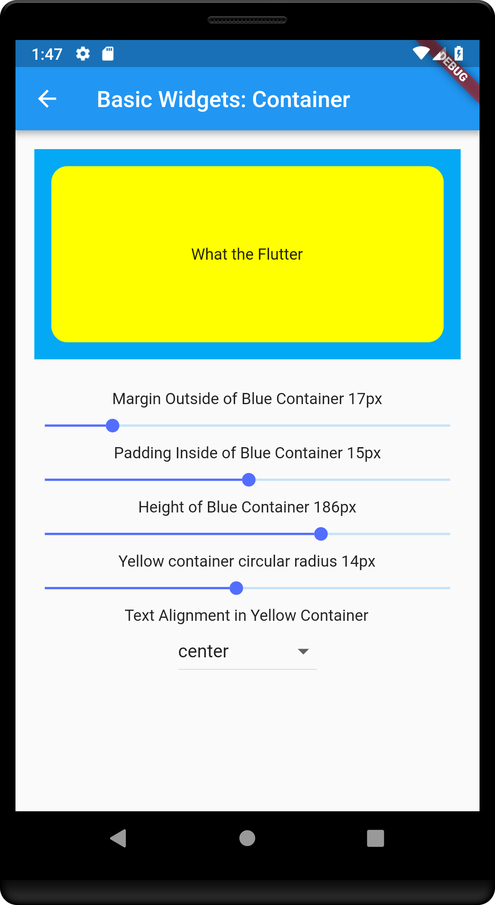
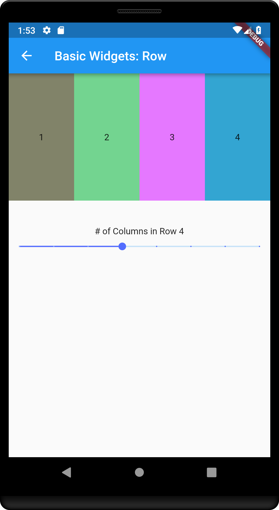
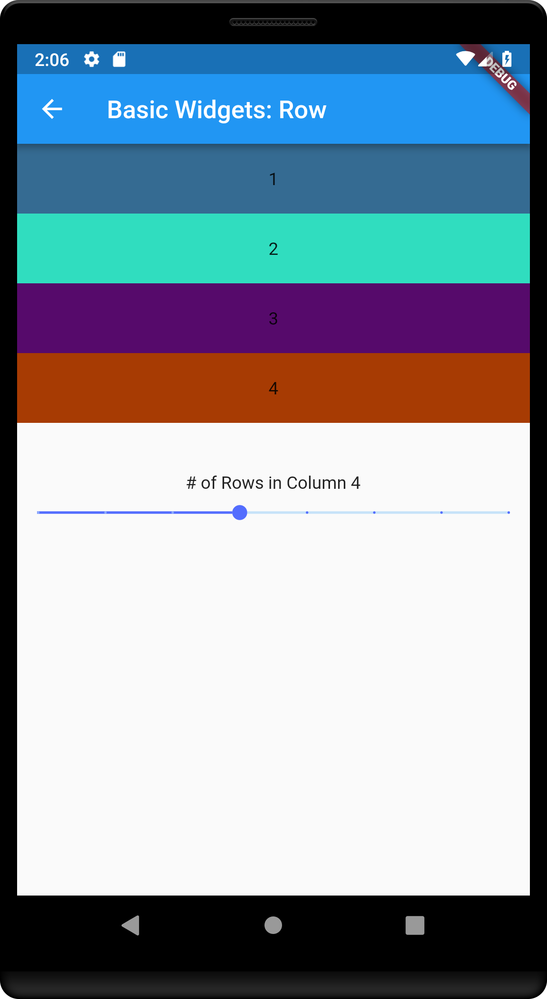

# What the Flutter (WTF)

### The demo application will cover some basic usage of various widgets.

*Tutorial 01 - Basic Widgets: Containers*

Containers are widgets that allows you to control the position, layout and style of child widgets contained inside. I have highlighted some properties of a container that you can change. There are more advanced properties which I will cover in other tutorials.



Sample Code:
```javascript
double _margin = 250; // set the margin outside of the container
double _height = 100.0; // set the height of the container to 100px you can also supply a width: xxx.xx in the BoxConstraints
double _padding = 5.0; // set the padding inside the container
double _radius = 10.0; // set the radius of the inner container
Alignment alignment = Alignment.center; // set the alignment of the child of the inner container

Container( // OUTER CONTAINER
  margin: EdgeInsets.all(_margin),
  constraints: BoxConstraints.expand(
      height: _height
  ),
  padding: EdgeInsets.all(_padding),
  color: Colors.lightBlue,
  child:  Container( // INNER CONTAINER
    decoration: BoxDecoration(
        color: Colors.yellowAccent,
        borderRadius: BorderRadius.circular(_radius)
    ),
    width: 1000,
    alignment: alignment,
    child: Text('What the Flutter'),
  ),
  transform: Matrix4.rotationZ(0),
)
```

*Tutorial 01 - Basic Widgets: Rows*

Rows are widgets that allows you to position one to many children side by side. In the tutorial the number of columns are dynamically generated based on the value of the _columns variable.



Sample Code:
```javascript
double _columns = 3; // set the number of columns to create inside a row

Widget buildRowWidgets(){
    List<Widget> list = new List<Widget>();

    for(var i = 0; i < _columns; i++){
      list.add(
        Expanded(child: AnimatedContainer(
          duration: Duration(milliseconds: 250),
          constraints: BoxConstraints.expand(
              height: 200,
          ),
          padding: EdgeInsets.all(20),
          child: new Text('${i}'),
          alignment: Alignment.center
        ))
      );
    }

    return new Row(children: list);
}
```

*Tutorial 01 - Basic Widgets: Columns*

Columns are widgets that allows you to stack one to many children on top of each other. In the tutorial the number of rows are dynamically generated based on the value of the _rows variable.



Sample Code:
```javascript
double _rows = 3; // set the number of rows to create inside a column

Widget buildRowWidgets(){
    List<Widget> list = new List<Widget>();

    for(var i = 0; i < _rows; i++){
      list.add(
          AnimatedContainer(
            duration: Duration(milliseconds: 250),
            padding: EdgeInsets.all(20),
            child: new Text('${i+1}'),
            alignment: Alignment.center,
            color: getRandomColor(),
          )
      );
    }

    return new Column(children: list, mainAxisSize: MainAxisSize.max,);
}
```